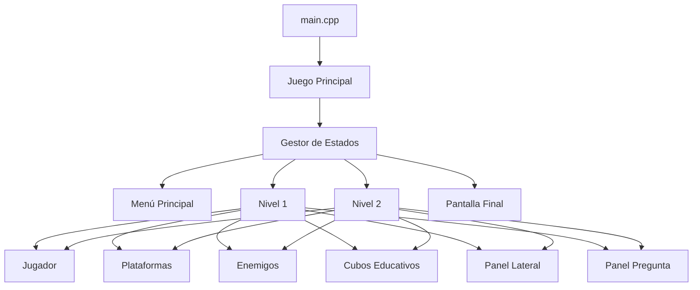
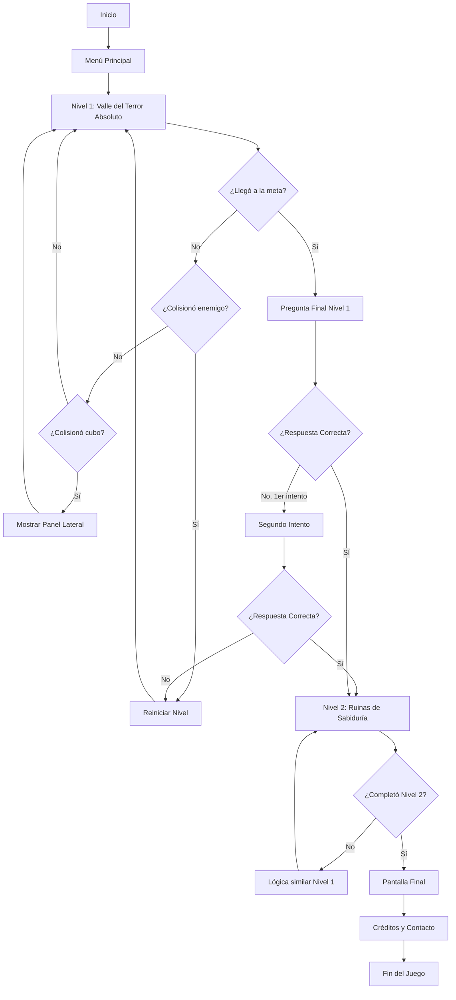

# 🎮 Plan de Desarrollo: Juego Educativo de Plataformas

## 📋 Resumen del Proyecto
**Nombre:** Juego de Plataformas Educativo  
**Tecnología:** C++ con SDL2  
**Tipo:** Juego vertical de plataformas con elementos educativos  
**Niveles:** 2 niveles iniciales  
**Resolución:** 800x600 (tamaño fijo)  

## 🎯 Estructura del Juego

### **Nivel 1: "El Valle del Terror Absoluto"**
- **Tema:** Matemáticas - Valor Absoluto
- **Plataformas:** 6-7 plataformas
- **Contenido:** Conceptos de valor absoluto, operaciones, notaciones, historia del concepto

### **Nivel 2: "Las Ruinas de la Sabiduría Antigua"**
- **Tema:** Historia - Antigua Grecia  
- **Plataformas:** 6-7 plataformas
- **Contenido:** Vida, creencias, filosofías, estilo de vida, curiosidades griegas

## 🏗️ Arquitectura Técnica



## 📁 Estructura de Archivos

```
game-project/
├── src/
│   ├── main.cpp
│   ├── Juego.cpp/.h
│   ├── Jugador.cpp/.h
│   ├── Plataforma.cpp/.h
│   ├── Enemigo.cpp/.h
│   ├── CuboEducativo.cpp/.h
│   ├── PanelLateral.cpp/.h
│   ├── PanelPregunta.cpp/.h
│   ├── GestorEstados.cpp/.h
│   └── Utilidades.cpp/.h
├── data/
│   ├── contenido_matematicas.txt
│   ├── contenido_historia.txt
│   ├── preguntas_nivel1.txt
│   └── preguntas_nivel2.txt
└── Makefile
```

## 🎮 Mecánicas de Juego

### **Controles:**
- ⬅️➡️ Flechas: Movimiento horizontal
- ⬆️ Flecha: Salto
- 🔤 A,B,C,D: Selección de respuestas

### **Elementos del Juego:**
1. **Jugador:** Rectángulo que se mueve y salta
2. **Plataformas:** Rectángulos estáticos donde el jugador puede pararse
3. **Enemigos:** Rectángulos que se mueven horizontalmente en cada plataforma
4. **Cubos Educativos:** Rectángulos que muestran información al colisionar
5. **Meta:** Área objetivo en la plataforma superior

### **Sistema de Colisiones:**
- **Jugador vs Plataforma:** Permite pararse y saltar
- **Jugador vs Enemigo:** Muerte instantánea → reinicio del nivel
- **Jugador vs Cubo:** Muestra panel lateral con información
- **Jugador vs Meta:** Activa pregunta final del nivel

## 🎨 Diseño Visual

### **Estilo:** Pixel Art Retro Simplificado
- **Paleta de colores limitada:** 12-16 colores retro
- **Formas geométricas:** Rectángulos con bordes pixelados
- **Sin sprites complejos:** Solo primitivas de SDL2

### **Elementos Visuales:**
- **Jugador:** Rectángulo azul (32x32 px)
- **Plataformas:** Rectángulos verdes (variable x 20 px)
- **Enemigos:** Rectángulos rojos (24x24 px)
- **Cubos:** Rectángulos amarillos (20x20 px)
- **Meta:** Rectángulo dorado (40x40 px)

## 📚 Sistema Educativo

### **Panel Lateral:**
- Aparece por 5 segundos al colisionar con cubo
- Ancho: 250px, Alto: 400px
- Posición: Lado derecho de la pantalla
- Reutilizable: Se puede volver a activar

### **Sistema de Preguntas:**
- Panel central: 500x300px
- 4 opciones múltiples (A, B, C, D)
- 2 intentos por pregunta
- Fallo = reinicio del nivel

## 🔄 Flujo del Juego



## 🛠️ Fases de Desarrollo

### **Fase 1: Configuración Base**
1. Configurar proyecto SDL2
2. Crear ventana 800x600
3. Implementar loop principal del juego
4. Sistema básico de renderizado

### **Fase 2: Mecánicas Básicas**
1. Clase Jugador con movimiento y salto
2. Sistema de física básica (gravedad)
3. Clase Plataforma y detección de colisiones
4. Controles (flechas + espacio)

### **Fase 3: Elementos del Juego**
1. Clase Enemigo con movimiento horizontal
2. Clase CuboEducativo
3. Sistema de colisiones completo
4. Detección de muerte y reinicio

### **Fase 4: Sistema Educativo**
1. PanelLateral para mostrar información
2. Carga de contenido desde archivos
3. PanelPregunta para preguntas finales
4. Sistema de intentos y validación

### **Fase 5: Niveles y Contenido**
1. Implementar Nivel 1 (Matemáticas)
2. Implementar Nivel 2 (Historia)
3. Crear contenido educativo
4. Diseñar preguntas finales

### **Fase 6: Pulimiento**
1. Pantalla de menú principal
2. Pantalla final con créditos
3. Mejoras visuales y efectos
4. Testing y optimización
